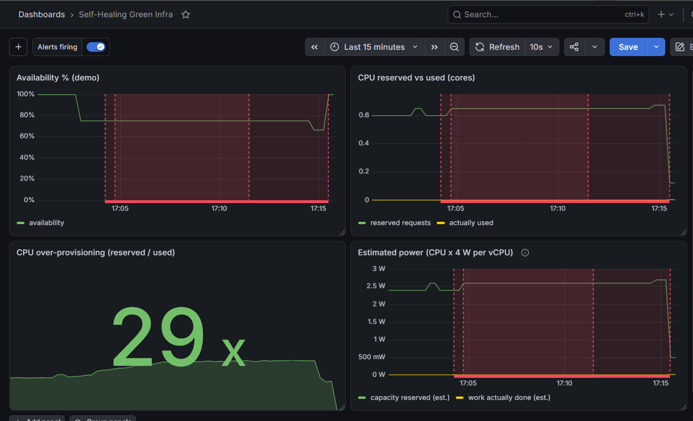
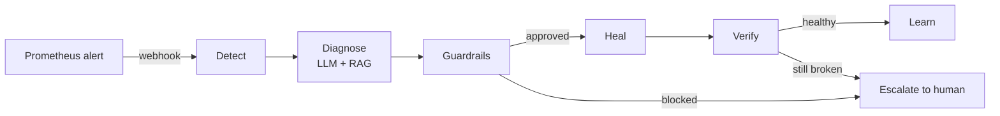

# Self-Healing Infra is Green Infra 🌱

> Using AI to cut Kubernetes waste without breaking things.

Prometheus tells you what broke. An AI agent figures out why and fixes it. Guardrails make sure it doesn't do anything stupid. And once your cluster can heal itself, you can stop over-provisioning "just in case".

**Self-healing is the means. Green is the result.**

**Status:** Phase 1 working end to end (local cluster, closed loop, dashboard, experiment). Phase 2 (AWS + CI/CD) is next. Built in public, one commit at a time.



---

## The problem

Teams over-provision Kubernetes. Big CPU requests, extra replicas, all "just in case". And honestly I get it, nobody wants a 2 AM call because a pod is crash-looping.

But that fear costs a lot. On my own demo cluster:

- **16.7%** CPU actually used vs **60%** CPU requested (whole cluster)
- In the demo namespace: **0.6 cores reserved vs ~0.002 used = 200-300x over-provisioned**

Reserved CPU nobody uses still needs servers switched on. That's money, energy and CO2 for nothing.

The funny part: most incidents are repeats (missing config, OOM, bad rollout) and the fix is already written in a runbook somewhere. A human still has to wake up, read logs and follow it.

## What it does

A closed loop that runs inside the cluster:



1. **Detect** - Prometheus fires an alert (e.g. `PodCrashLooping`), Alertmanager calls the agent's webhook.
2. **Diagnose** - the agent collects evidence (logs, ConfigMaps, restarts), RAG pulls the matching runbook + past incidents from ChromaDB, and the LLM returns a JSON fix plan (root cause, action, risk, confidence).
3. **Guardrails** - the plan has to pass safety checks before anything runs.
4. **Heal** - apply the fix (e.g. attach the missing ConfigMap).
5. **Verify** - wait for the rollout and check the pod is actually healthy. No fake success.
6. **Learn** - only verified fixes get saved back into memory, so next time its own experience is the top match.

Once healing is fast and reliable, you can **rightsize**: give apps what they really use, not what fear says.

## Results

### Healing speed (MTTR = mean time to recovery)

| Who fixed it | MTTR |
|---|---|
| Nobody (the original broken pod) | sat broken **6.5 hours**, 23 restarts |
| Agent, rules brain, human approves (ask mode) | **11.9 s** |
| Agent, LLM brain, fully auto | **4.4 s** |
| Full closed loop in-cluster (alert → webhook → LLM → heal → verify) | **14.4 s** |

### Before / after experiment

Same workload, same failures (Chaos Mesh kills a pod every 5 min + a config bug injected at minute 2), 20 min each.

| Metric | Setup A: over-provisioned, no agent | Setup B: rightsized + agent | Change |
|---|---|---|---|
| CPU reserved | _TBD_ | _TBD_ | _TBD_ |
| Availability (SLO) | _TBD_ | _TBD_ | _TBD_ |
| Config bug MTTR | _TBD_ | _TBD_ | _TBD_ |
| Energy (kWh, estimated) | _TBD_ | _TBD_ | _TBD_ |
| CO2 (kg, estimated) | _TBD_ | _TBD_ | _TBD_ |

### Plot twist: waste blocked the healing 🤯

While building the dashboard I broke the app on purpose. The agent diagnosed it right (confidence 0.95) and applied the right fix in seconds... and then the fixed pod sat **Pending for 7+ minutes**:

```
0/1 nodes are available: 1 Insufficient cpu.
```

The node had 2 cores, all **booked**, while almost nothing was **used**. The over-provisioned app was holding CPU it never touched, so the healing pod couldn't get a seat. The agent did the safe thing: `verify_failed` (honest), one retry, then `max heal attempts reached` and stopped.

I rightsized the waster with Helm (2 × 250m → 1 × 25m), the pending pod got scheduled instantly, availability went back to 100%.

- reserved CPU **0.65 → ~0.12 cores**
- over-provisioning **334x → 29x**
- estimated power **~2.6 W → ~0.5 W**

We didn't add capacity. We freed it.

## Architecture


Editable source: [`docs/architecture.drawio`](docs/architecture.drawio) (open at app.diagrams.net). The diagram shows the full vision, including the Phase 2 parts (AWS, Jenkins, Argo CD).

| Piece | What it does here |
|---|---|
| **kind** | Local Kubernetes cluster (Kubernetes IN Docker), runs in GitHub Codespaces |
| **Helm** | Installs everything: monitoring stack, Kepler, Chaos Mesh, demo apps |
| **Prometheus + Alertmanager** | Metrics, alert rules, webhook to the agent |
| **Grafana** | Dashboard: availability, CPU reserved vs used, waste ratio, estimated power, alert annotations |
| **Kepler** | Per-pod energy share (CNCF project) |
| **Chaos Mesh** | Breaks things on purpose, on a schedule |
| **Python agent** | The loop: tools, guardrails, webhook server |
| **Groq (`openai/gpt-oss-120b`)** | The LLM brain. Model name lives in config, not code |
| **ChromaDB** | RAG memory: runbooks + verified past incidents |

### Tech stack: built vs planned

| Area | Built (Phase 1) | Planned (Phase 2) |
|---|---|---|
| Containers | Docker, Kubernetes (kind), Helm | EKS |
| Observability | Prometheus, Alertmanager, Grafana, Kepler | |
| Chaos | Chaos Mesh | |
| AI | Python agent, RAG with ChromaDB, Groq | Tool-calling loop, Bedrock / Ollama, LLM eval suite |
| Cloud & IaC | | AWS (EKS, ECR, IAM), Terraform |
| CI/CD | | Jenkins (CI + Trivy scan + LLM eval gate), Argo CD (GitOps) |
| Config mgmt | | Ansible (node-level fixes) |

## How it works

| File | Job |
|---|---|
| `agent/src/healer/k8s_tools.py` | The agent's eyes and hands: find unhealthy pods, read logs, list ConfigMaps, find the owning Deployment, patch it, wait for rollout |
| `agent/src/healer/prom_tools.py` | PromQL queries: crash-looping pods, restarts, CPU reserved vs used |
| `agent/src/healer/rag.py` | ChromaDB: index runbooks, retrieve similar ones, remember verified incidents |
| `agent/src/healer/llm.py` | Sends evidence + retrieved runbooks to the LLM, validates the JSON plan |
| `agent/src/healer/main.py` | The loop: detect → evidence → diagnose → guardrails → heal → verify → learn. Modes: `dry-run`, `ask`, `auto` |
| `agent/src/healer/server.py` | Webhook: `POST /alert` from Alertmanager, `GET /healthz` |
| `runbooks/*.md` | What a human would do: missing config, OOMKilled, image pull, over-provisioned |
| `monitoring/rules/demo-alerts.yaml` | Alert rules. `heal="true"` routes to the agent |

Detection uses **multiple signals** (waiting reason, exit code, OOMKilled, restarts + not ready), because a pod's status is just a snapshot and a crash-looping pod is "Running" for 1-2 seconds every cycle.

## Safety: why the AI can't do anything stupid

- **Action allowlist** - the agent can only do actions it knows. Anything else → escalate.
- **Hallucination guard** - if the LLM names a ConfigMap that isn't in the evidence, the plan is blocked.
- **Confidence + risk gate** - auto mode needs confidence ≥ 0.8 and low risk. Otherwise ask a human.
- **Max 2 attempts** - no infinite heal loops (this actually triggered for real, see the plot twist).
- **Protected namespaces** - `kube-system` and friends are untouchable.
- **Verify before claiming success** - and ignore pods that are already on their way out.
- **Learn only verified fixes** - no memory poisoning.
- **Deterministic LLM** - `temperature: 0` + JSON mode.
- **Least-privilege RBAC** - the agent's ServiceAccount can read pods/logs/ConfigMaps and patch Deployments, **only in `demo`**. It can't delete pods, read Secrets or touch `kube-system` (checked with `kubectl auth can-i --as=...`).
- **Unit tested** - `agent/tests/test_safety.py`, 10 tests, no cluster or LLM needed.
- **Rightsizing is NOT automatic** - healing restores desired state (safe, reversible). Changing capacity is a business decision, so it stays human-approved and goes through Helm/Git. The `NamespaceOverProvisioned` alert is `heal="false"` on purpose.

## How the energy numbers are measured (honestly)

Cloud VMs (and Codespaces) don't expose CPU power sensors (RAPL), so Kepler runs with its fake meter here. That means:

- ❌ I never show Kepler's absolute watts as measured results.
- ✅ **Real:** CPU reserved vs used (Prometheus), and each pod's % share of power (Kepler splits power by real CPU use).
- ✅ **Estimated, method disclosed:** energy = real CPU core-hours × **~4 W per vCPU**, CO2 = kWh × **~0.7 kg/kWh** (India grid). Same idea as tools like Cloud Carbon Footprint.
- Headline is always **relative**: "X% less CPU reserved → X% less estimated energy, SLO still met".

Reserved CPU counts as energy because servers are bought and kept on for what's reserved, not what's used.

## Quick start

Tested on GitHub Codespaces (2-core works but it's tight, 4-core is comfier).

```bash
# 0. secrets (never commit .env)
cp .env.example .env   # add GROQ_API_KEY

# 1. cluster + Prometheus/Grafana/Alertmanager + Kepler
bash scripts/setup-cluster.sh
kubectl apply -f monitoring/rules/demo-alerts.yaml

# 2. Chaos Mesh (kind uses containerd)
helm repo add chaos-mesh https://charts.chaos-mesh.org && helm repo update
helm upgrade --install chaos-mesh chaos-mesh/chaos-mesh -n chaos-mesh --create-namespace \
  -f chaos/chaos-mesh-values.yaml --wait

# 3. demo apps
docker build -t demo-app:v1 apps/demo-app
kind load docker-image demo-app:v1 --name green-infra
helm upgrade --install healthy-app   helm/demo-app -n demo --create-namespace -f helm/values/healthy.yaml
helm upgrade --install overprov-app  helm/demo-app -n demo -f helm/values/overprov.yaml
helm upgrade --install crashloop-app helm/demo-app -n demo -f helm/values/crashloop.yaml

# 4. the agent, in-cluster
docker build -f agent/Dockerfile -t healing-agent:v1 .
kind load docker-image healing-agent:v1 --name green-infra
kubectl apply -f k8s/agent/agent.yaml
set -a; source .env; set +a
kubectl create secret generic groq-api -n healing-agent \
  --from-literal=GROQ_API_KEY="$GROQ_API_KEY" --dry-run=client -o yaml | kubectl apply -f -
```

Then watch it heal:

```bash
kubectl get pods -n demo -w
kubectl logs -n healing-agent deploy/healing-agent -f
```

**Grafana:** `kubectl -n monitoring port-forward svc/monitoring-grafana 3000:80` → Dashboards → New → Import → `monitoring/dashboards/self-healing-green-infra.json`.

**Break it again:**

```bash
helm uninstall crashloop-app -n demo && helm install crashloop-app helm/demo-app -n demo -f helm/values/crashloop.yaml
```

**Run the experiment:** `bash scripts/experiment.sh a` then `bash scripts/experiment.sh b`.

**Run the agent locally** (handy for debugging):

```bash
cd agent && uv venv --python 3.12 .venv && source .venv/bin/activate && uv pip install -r requirements.txt
PYTHONPATH=src python -m healer.main --namespace demo --mode dry-run --once   # or ask / auto, --brain llm|rules
PYTHONPATH=src python -m pytest tests -q
```

**After a Codespace restart:** `bash scripts/resume.sh` (starts the node, fixes kind's network, shows unhappy pods).

## Repo layout

```
agent/            Python agent (src/healer), Dockerfile, tests
apps/demo-app/    Flask demo app (can crash on purpose)
chaos/            Chaos Mesh values + experiments
helm/demo-app/    Helm chart for the demo apps
helm/values/      healthy, overprov, overprov-rightsized, crashloop
k8s/              kind config + agent manifests (RBAC, Deployment, Service)
monitoring/       Prometheus/Kepler values, alert rules, Grafana dashboard
runbooks/         Knowledge the agent retrieves (RAG)
scripts/          setup, resume, fix-network, teardown, experiment
docs/             architecture (png + drawio) + screenshots
evals/            (Phase 2) LLM scenario evaluation suite
ansible/          (Phase 2) node and OS-level remediation playbooks
```

## Lessons learned

Real stuff I hit while building this:

- **Waste can block healing.** `Insufficient cpu` with ~0.2% CPU actually used. Booked ≠ used.
- **Config drift is sneaky.** A manual `kubectl set env` wasn't undone by `helm upgrade`, because Helm only manages the fields it owns (server-side apply). Do changes through Helm/Git.
- **Pod status is a snapshot.** My first detector said "all healthy" during a CrashLoopBackOff (race condition). Fix: check several signals.
- **Fixing one bug can expose another.** Verify said "failed" while the fix worked, because the old pod was still dying. Fix: ignore terminating pods + wait to settle. A false "failed" is safer than a false "success".
- **Never hard-code a model name.** Groq retired the model I started with overnight. Keep it in config.
- **Helm accepts unknown values silently.** Kepler ignored my old-style setting and crash-looped. Check the app's own logs, and the docs for *your* version.
- **kind in Codespaces loses internet on restart** (iptables legacy vs nft). `scripts/fix-network.sh` fixes it.
- **Special characters in a Grafana panel title** (÷, ×) broke the queries with a 400. Plain titles only.

## Roadmap

- **Rightsizer that opens a PR** - the agent calculates peak usage + safety margin, edits `values.yaml` and opens a GitHub PR with the evidence. A human clicks Merge. Automated work, human judgment, everything in Git history.
- Persistent RAG memory (PersistentVolume), so the agent keeps its experience across restarts.
- More healing actions with guardrails: OOMKilled → raise memory limit, bad rollout → rollback.
- Escalate with a rightsizing suggestion when a heal is stuck on `Insufficient cpu`.
- Run on AWS: Terraform + EKS + ECR, Bedrock as an LLM option, Argo CD for GitOps.
- CI: Jenkins + Trivy scan + an LLM eval suite as a quality gate.

## Talk

Built for my talk **"Self-Healing Infra is Green Infra: Using AI to Cut Kubernetes Waste Without Breaking Things"** at the **Cloud Native Pune x Docker Pune** meetup, **17 Oct 2026**.

## Author

**Malisha Gavali** - [LinkedIn](https://linkedin.com/in/malisha) | [GitHub](https://github.com/Malisha27)

## License

MIT