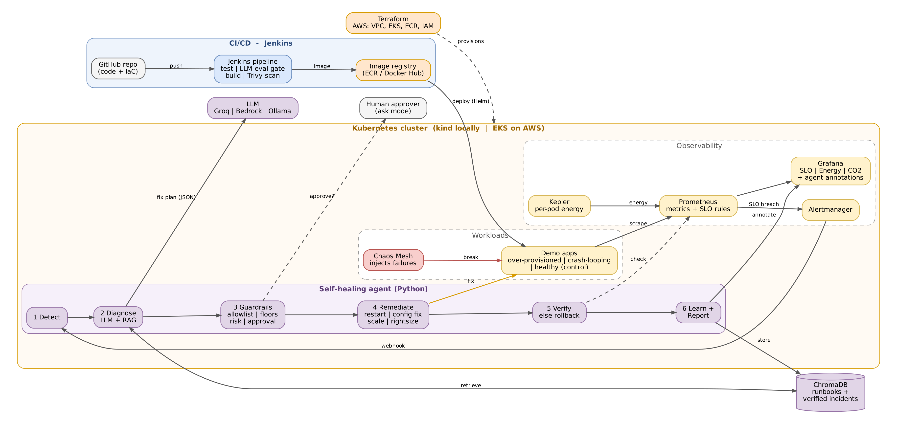

# Self-Healing Green Infra

> Self-healing infrastructure is green infrastructure: if the cluster can fix itself, it can run leaner.

**Status:** In progress (v2 rebuild). Built in public, one commit at a time.

## The problem

Teams over-provision Kubernetes workloads "just in case" because failures are costly and slow to fix by hand. That idle capacity wastes money, energy and carbon. Reliability and efficiency are usually treated as separate problems with separate tools.

## The idea

A closed-loop AI agent that **detects, diagnoses, remediates and verifies** failures on Kubernetes, safely and with guardrails. Once recovery is fast and reliable, workloads can be **rightsized**. The project measures the result in SLOs, MTTR, cost and energy (kWh, CO2).

```
Detect -> Investigate (LLM + RAG) -> Guardrails -> Remediate -> Verify -> Learn -> Report
```

## Architecture



Editable source: [`docs/architecture.drawio`](docs/architecture.drawio) (open at app.diagrams.net)

## Tech stack

| Area | Tools |
|---|---|
| Cloud & IaC | AWS (EKS, ECR, IAM, Bedrock), Terraform |
| Containers | Docker, Kubernetes (kind for local dev), Helm |
| CI/CD | Jenkins (CI), Argo CD (GitOps CD), Trivy (image scanning) |
| Observability | Prometheus, Alertmanager, Grafana, Kepler (energy) |
| Chaos | Chaos Mesh |
| AI | Python agent, tool calling, RAG with ChromaDB, Groq / Bedrock / Ollama |
| Config mgmt | Ansible |

## Repository layout

| Folder | What lives here |
|---|---|
| `agent/` | Python self-healing agent (source, tests, Dockerfile) |
| `apps/` | Demo workloads: over-provisioned, crash-looping, healthy |
| `helm/` | Helm charts for the apps and the agent |
| `terraform/` | AWS infrastructure as code (VPC, EKS, ECR, IAM) |
| `k8s/` | Manifests for Argo CD, monitoring stack, Chaos Mesh |
| `monitoring/` | Prometheus alert rules and Grafana dashboards (JSON) |
| `chaos/` | Chaos Mesh experiments |
| `runbooks/` | Markdown runbooks used as the RAG knowledge base |
| `evals/` | LLM scenario evaluation suite |
| `ansible/` | Node and OS-level remediation playbooks |
| `scripts/` | Helper scripts (local cluster setup, experiment runs) |
| `docs/` | Architecture diagram and problem statement |

## Roadmap

- [ ] Local kind cluster with Prometheus, Grafana, Kepler
- [ ] Demo apps + Helm charts
- [ ] Agent v2: tool-calling investigation loop
- [ ] Guardrails, approval modes, verify and rollback
- [ ] RAG over runbooks and verified incidents
- [ ] Chaos experiments + before/after energy experiment
- [ ] Grafana dashboards (SLO, energy, agent actions)
- [ ] Jenkins pipeline with LLM eval gate and Trivy scan
- [ ] Argo CD GitOps deployment
- [ ] Terraform for AWS (EKS, ECR, IAM)
- [ ] Results write-up

## Results

Coming soon: MTTR, CPU reduction, kWh and CO2 saved, agent eval scores.

## Author

**Malisha Gavali** - [LinkedIn](https://linkedin.com/in/malisha) | [GitHub](https://github.com/malisha)

## License

MIT
